# SACR Tool — Sentiment Analysis on Customer Reviews

A **Streamlit** web application for performing end-to-end sentiment analysis on customer review text data. Users upload a dataset, preprocess text, explore it visually, engineer features, train ML classifiers, compare models, and export results.

---

## Architecture Overview




---

## Data Flow

```
1. Upload CSV/Excel/JSON/TXT
         │
         ▼
2. Data Validation (empty check, null columns, size check)
         │
         ▼
3. Text Preprocessing
   - Contraction expansion
   - URL/HTML removal
   - Special chars & numbers removal
   - Lowercasing
   - Stopword removal
   - Lemmatization
         │
         ▼
4. Binary Labeling (keyword-based: good/excellent/positive → 1)
         │
         ▼
5. Vectorization (CountVectorizer or TF-IDF)
   - Configurable n-gram range, min_df, max_features
         │
         ▼
6. Train/Test Split (default 80/20, configurable)
         │
         ▼
7. Model Training (choose one or compare all)
   - Hyperparameters adjustable via sidebar sliders
         │
         ▼
8. Evaluation → Metrics → CSV/PDF Export
```

---

## Tech Stack

| Component | Library/Tool |
|-----------|-------------|
| **Frontend** | [Streamlit](https://streamlit.io) |
| **ML Models** | scikit-learn (LogisticRegression, DecisionTreeClassifier, RandomForestClassifier, AdaBoostClassifier, MultinomialNB) |
| **NLP** | NLTK (stopwords, WordNetLemmatizer), contractions |
| **Vectorization** | CountVectorizer, TfidfVectorizer |
| **Feature Selection** | chi2 (chi-squared) |
| **Visualization** | Matplotlib, Seaborn, WordCloud |
| **Export** | FPDF (PDF), pandas (CSV) |
| **Data Handling** | pandas, numpy |

---

## Sections (7 Tabs)

1. **Data Preprocessing** — Upload, validate, clean text, convert categorical sentiment to binary, progress bar for large datasets
2. **EDA** — Shape, columns, summary stats, WordCloud by positive/negative sentiment (supports numeric ratings and categorical labels)
3. **Visualization** — Heatmap, pairplot, class imbalance, N-gram analysis (1–5 grams), word count distributions
4. **Feature Engineering** — Lemmatization, labeling, vectorization with tunable parameters, Chi² feature importance
5. **Models** — Train any of 5 classifiers with adjustable hyperparameters, view metrics, download CSV/PDF reports
6. **Model Comparison** — Compare all trained models in a table and charts, "Quick Train All" default models
7. **About Us** — App description

---

## How to Run

```bash
# Create virtual environment
python -m venv .venv

# Activate it
.venv\Scripts\activate       # Windows
source .venv/bin/activate    # Linux/Mac

# Install dependencies
pip install streamlit pandas numpy matplotlib seaborn nltk scikit-learn wordcloud contractions fpdf

# Run the app
streamlit run mlweb.py
```

---

## Notes

- `mlweb.py` is the active version; `main.py` is an older version kept for reference
- Large virtual environment (`.venv/`) is excluded from version control via `.gitignore`
- The app uses **session state** to persist data across pages (data, preprocessing, feature engineering, model results)
